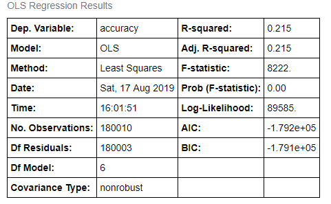
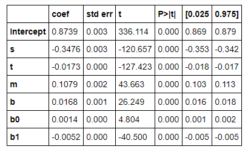

# atypical_doseresponse_classifier
This repo comprises a *novel* method to identify atypical dose-response curves using a Convolutional Neural Network trained from simulation data. Most of the implementation is aimed at 7-dose response curves and aim to predict hermetic transition points.

# data
Data for training and testing the CNN can be found [here](https://drive.google.com/drive/folders/1bF-OeHiamdALTz2jKnEzqkbnq_rBEBxl?usp=sharing).
    This is a synthetic dataset, prduced using the methods described in [synthetic_doseresponse_generator](https://github.com/nathanieljevans/synthetic_doseresponse_generator) 

# performance 

Details on how these metrics were caculated can be found in `hermetic_cnn_test.py`.  

> average observation dose point classification error: **89.7%** 

> dose point classification specificity: **73.9%** 

> dose point classfication sensitivity: **99.8%** 

A more in-depth performance analysis can be found in [here](./python/performance_analysis.ipynb). As a general overview, the parameter space regression is shown below. 

